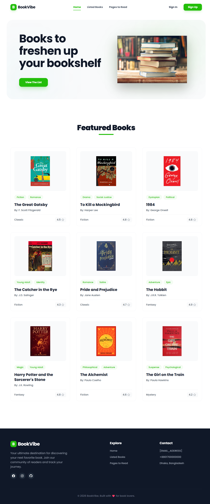

# BookVibe - Premium Book Management Platform

BookVibe is a modern, premium web application designed for book enthusiasts to discover, track, and manage their reading journey. Built with a focus on clean aesthetics and smooth user experience, it allows users to maintain a personal bookshelf with "Read" and "Wishlist" categories.

## 🚀 Live Demo

[Visit Project](https://book-vibe-sable.vercel.app/)

> If the live URL is not active yet, replace this link with the deployed application URL after deployment.

## ✨ Key Features

- **Discover Books**: Browse a curated list of books with beautiful covers and essential details.
- **Detailed Insights**: View comprehensive information for each book, including reviews, ratings, and publishing details.
- **Smart Tracking**: 
  - Add books to your **Read List**.
  - Save books for later in your **Wishlist**.
  - Intelligent validation prevents adding the same book twice or adding a read book to the wishlist.
- **Advanced Sorting**: Organize your bookshelf by:
  - Rating (High to Low)
  - Number of Pages (High to Low)
  - Publishing Year (Newest to Oldest)
- **Responsive Design**: A seamless experience across mobile, tablet, and desktop devices.
- **Premium UI**: 
  - Modern **Poppins** typography.
  - Smooth entrance animations (Fade-in, Slide-up).
  - Interactive hover effects and micro-animations.
  - Dark-themed professional footer.

## 🚀 Tech Stack

- **Frontend**: React.js (Vite)
- **Styling**: Tailwind CSS & DaisyUI
- **Icons**: React Icons (Fa, Bs, Ci)
- **Routing**: React Router
- **State Management**: React Context API
- **Notifications**: React Toastify
- **Typography**: Google Fonts (Poppins)

## 🛠️ Installation & Setup

1. **Clone the repository:**
   ```bash
   git clone https://github.com/Redwanhossain200/book-vibe.git
   ```

2. **Navigate to the project directory:**
   ```bash
   cd book-vibe
   ```

3. **Install dependencies:**
   ```bash
   npm install
   ```

4. **Start the development server:**
   ```bash
   npm run dev
   ```

## 📁 Project Structure

- `src/components`: Reusable UI components (Navbar, Banner, BookCard, etc.).
- `src/context`: Centralized state management using Context API.
- `src/pages`: Main page views (Homepage, BookDetails, Bookshelf).
- `src/layout`: Main application layout including the Footer.
- `src/assets`: Image assets and static files.
- `public/booksData.json`: Mock data for the book library.

## 🎨 Design Philosophy

BookVibe follows a **"Clean, Simple, and Beginner-Friendly"** design philosophy. The interface uses a light, airy color palette with vibrant accents of emerald green (`#23BE0A`). The codebase is intentionally kept clean and free of unnecessary comments for a professional look.


### 📸 Project Preview



---

Built with ❤️ by Redwan Hossain
